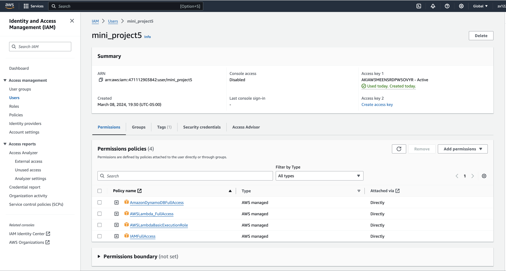
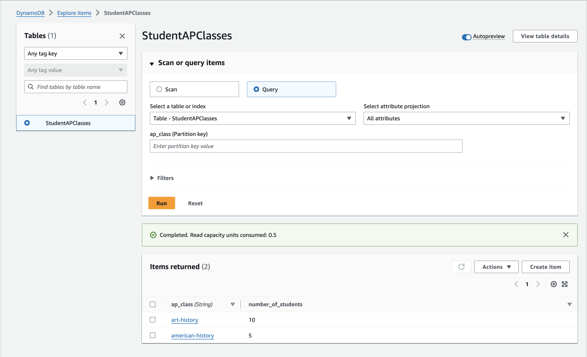
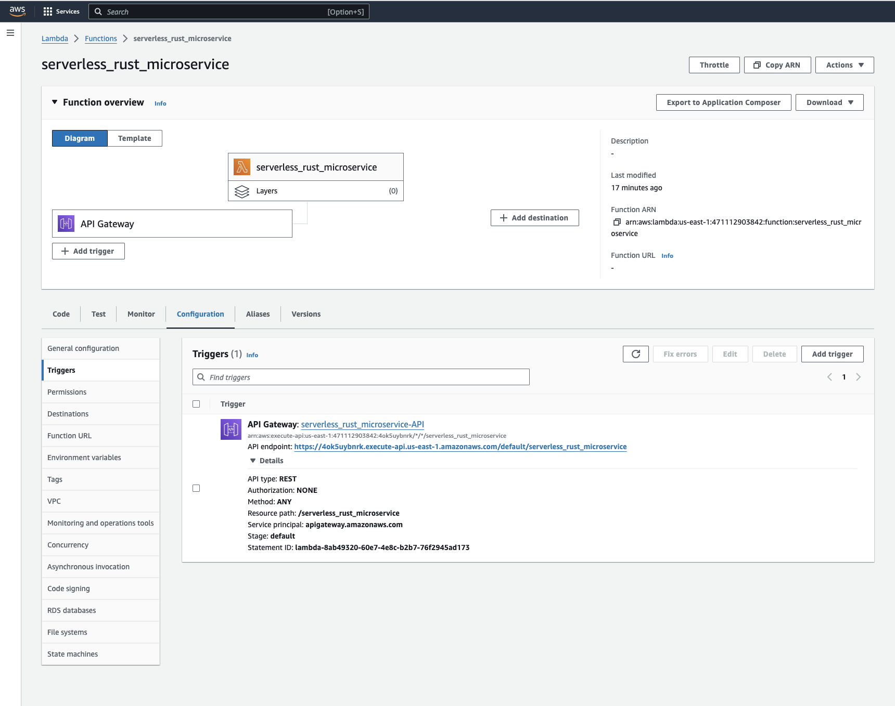
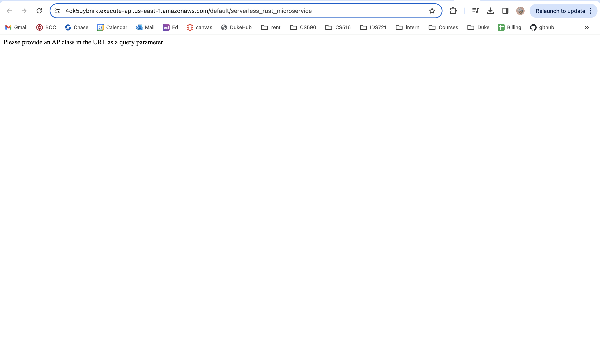
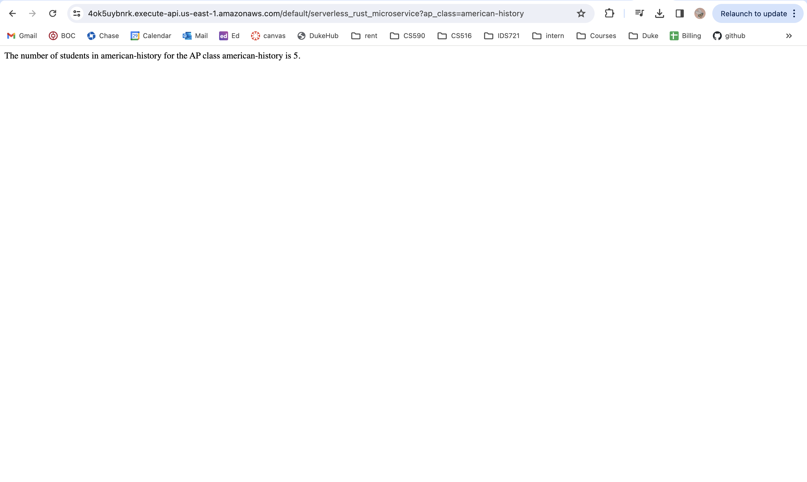
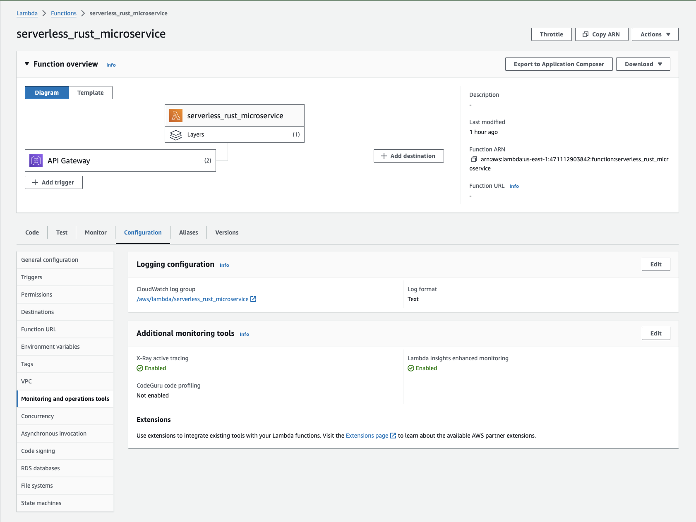
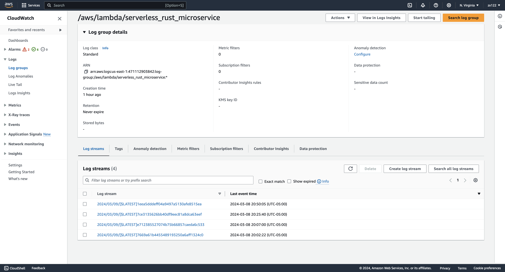
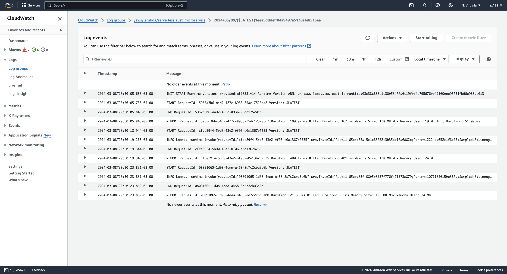

# miniproj6: Rust Lambda Function with Logging and Tracing

Instrument a Rust Lambda Function with Logging and Tracing. This project is based on [my mini-project5](https://gitlab.com/zx122/mini-project5) and use the same lambda function: return the number of students in a class given the an ap class name.

## Procedure

### First Step: Instrument a Rust Lambda Function:
#### Option1: following the same procedures as in mini project5 to build the lambda function, and connect it to DynamoDB: 
1. install Rust and Cargo Lambda, then in the desired folder, do `cargo lambda new <YOUR-PROJECT-NAME>`
2. inside the `<YOUR-PROJECT-NAME>/src` folder, update the code in files `main.rs` to achieve the functionality of returning the number of students in each ap class.
2. inside the directory just created update the dependencies in `Cargo.toml` to have:
```
[dependencies]
aws-config = { version = "1.1.7", features = ["behavior-version-latest"] }
aws-sdk-dynamodb = "1.16.1"
lambda_http = "0.10.0"
tokio = { version = "1", features = ["full"] }
```
3. Go to AWS Console and navigate to `IAM`. Create a new user and grant access (the same precesure as in the previous mini-projects):
 

4. Under Security Sredentials section, generate an access key for API access. Then, set up environment variables so that cargo lambda knows which AWS account and region to deploy to by typing these two lines in the terminal inside the rust project directory:
```
export AWS_ACCESS_KEY_ID="your_access_key_here"
export AWS_SECRET_ACCESS_KEY="your_secret_key_here"
```
5. Go back to AWS Console and navigate to `DynamoDB`. Create a table using the correct table name as written in the `main.rs` file and put the the name of primary key of the table in the `Partition key` box. We could manually add items to the table. TODO: there should be a faster way of doing it though.
 

6. Build the project by running `cargo lambda build --release`
7. Deploy the project by running `cargo lambda deploy`

8. Go to AWS Console and navigate to `Lambda`, inside `Function`: If cargo lambda deploy success, you may see the deployed lambda function on AWS, the lambda function should be ready and shown under the list, click on the function name (in my case: `serverless_rust_microservice`), under `Configuration`, click `Permission`, then click the `link` under your Role name

9. attach policies `AWSDynamoDBFullAccess` and `AWSLambdaBasicExecutionRole` to your role.

10. link  Lambda function with AWS API Gateway: click on `Add Trigger`, under the "choose a source", choose `API Gateway`, then choose `create a new API`, then choose `REST API`, click Add.

11. click on the link next to `API Gateway`, inside the Trigger tab, then create a new resource for your API's endpoint. For the created resource, implement an ANY method and associate it with your Lambda function. Click deploy, find stages and find your invoke URL.

 

12. click on the link after `API endpoint`: it will take you to a new page that looks like this:
 

13. attach `?ap_class=american-history` at the end of that url, the it will returns the number of students in ap american-history class. 
 

#### Option2: directly copy the rust directory into the new folder
1. then remember to attach the aws keys: in the new_directory/project_name, type these into the terminal
```
export AWS_ACCESS_KEY_ID="your_access_key_here"
export AWS_SECRET_ACCESS_KEY="your_secret_key_here"
```
2. same as before: do `cargo lambda build --release` and `cargo lambda deploy`, we don't need all the other stes above since we are using the same exact `serverless_rust_microservice` lambda function as before. All the polies and attachment should be set up already if mini project5 has been implemented.

### Second Step: Logging and Tracing
1. In AWS Lambda settings, navigate to Configuration > Monitoring and operations tools > Additional monitoring tools
2. enable `X-ray active tracing` and `CloudWatch Lambda Insights`
 

3. You will then be able to see function invocation statistics in your Cloudwatch dashboard: Navigate to Cloudwatch, then click log groups and choose the lambda function to see the stats:
 
 
